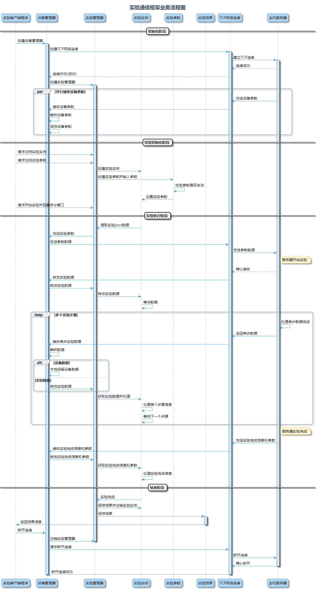

# SpinQLabLink

SpinQLabLink是一个Python库，用于与SpinQ量子计算实验平台进行交互。它提供了一套简单的API，允许用户启动实验、上传数据、获取实验结果等。

## 安装

### 从PyPI安装

```bash
pip install spinqlablink
```

### 从源代码安装

```bash
# 克隆仓库
git clone https://github.com/spinqtech/spinqlablink.git
cd spinqlablink

# 安装依赖
pip install -r requirements.txt

# 安装
pip install .

# 或者安装开发模式
pip install -e .
```

## 使用方法

### 使用Python API

```python
from spinqlablink import api

# 启动实验
experiment_id = "exp-001"
experiment_type = "circuit"
config = {
    "circuit": {...},
    "shots": 1000,
    # 其他配置
}

success = api.start_experiment(
    experiment_id=experiment_id,
    experiment_type=experiment_type,
    config=config
)

# 上传数据
data = {...}  # 实验数据
api.upload_experiment_data(experiment_id, data)

# 结束实验
api.finish_experiment(experiment_id, status="completed")

# 获取结果
result = api.get_experiment_result(experiment_id)
print(f"实验结果: {result}")
```

### 使用命令行

安装后，可以使用命令行工具`spinqlablink`进行操作：

```bash
# 启动实验
spinqlablink start --type circuit --config config.json

# 上传数据
spinqlablink upload --id exp-001 --data data.json

# 结束实验
spinqlablink finish --id exp-001 --status completed

# 获取结果
spinqlablink result --id exp-001 --format json --output result.json

# 获取状态
spinqlablink status --id exp-001

# 获取实验列表
spinqlablink list --limit 10 --offset 0
```

## 日志配置

可以通过以下方式配置日志：

```python
from spinqlablink.utils import setup_default_logger

# 设置日志级别和日志目录
logger = setup_default_logger(log_level='debug', log_dir='logs')

# 直接使用导出的日志函数
from spinqlablink.utils import info, error

info("这是一条信息日志")
error("这是一条错误日志")
```

## 命令行帮助

```bash
spinqlablink --help
```

## 支持的实验类型

- `circuit`: 量子电路实验
- `pulse`: 量子脉冲实验
- `calibration`: 量子校准实验

## 许可证

MIT 

## 实验流程图


