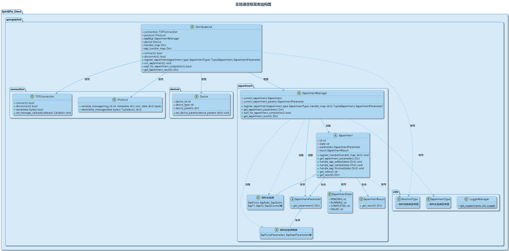
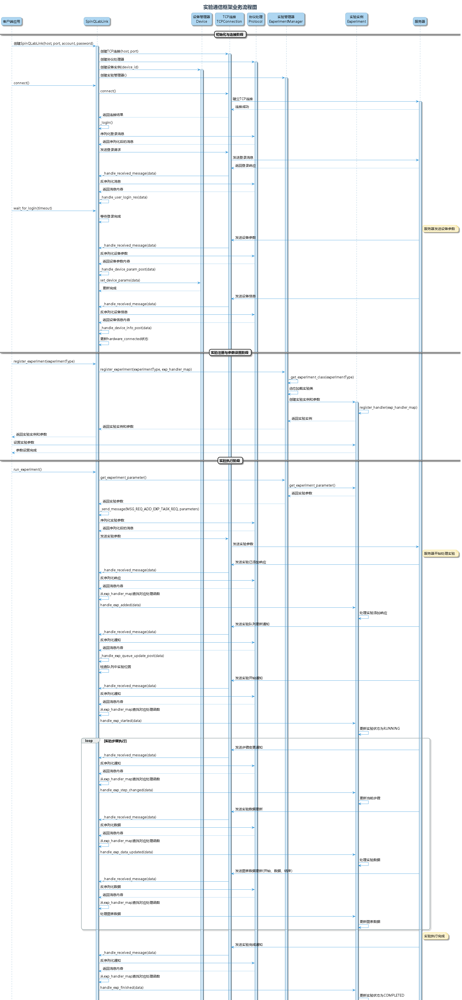

# SpinQLabLink

SpinQLabLink是一个Python库，用于与SpinQ量子计算实验平台进行交互。它提供了一套简单的API，允许用户连接设备、注册实验、设置参数、运行实验并获取结果。

## 安装

### 从PyPI安装

```bash
pip install spinqlablink
```

### 从源代码安装

```bash
# 克隆仓库
git clone https://github.com/spinqtech/spinqlablink.git
cd spinqlablink

# 安装依赖
pip install -r requirements.txt

# 安装
pip install .

# 或者安装开发模式
pip install -e .
```

## 快速入门

下面是一个简单的使用示例，演示如何连接设备并运行一个NMR脉冲实验：

```python
from spinqlablink import SpinQLabLink, ExperimentType, Pulse

# 创建连接
spinqlablink = SpinQLabLink("192.168.9.121", 8181, "username", "password")
spinqlablink.connect()

# 等待登录完成
if not spinqlablink.wait_for_login():
    print("登录失败")
    exit(1)

# 注册NMR脉冲实验
_, exp_pulse_para = spinqlablink.register_experiment(ExperimentType.NMR_PHENOMENON_AND_SIGNAL)

# 设置脉冲参数
exp_pulse_para.pulses = [Pulse(path=0, width=40, amplitude=100, phase=90, detuning=0)]

# 设置其他参数
exp_pulse_para.freq_h = 37.852105  # 氢共振频率 (MHz)
exp_pulse_para.freq_p = 15.322872  # 磷共振频率 (MHz)
exp_pulse_para.makePps = True      # 生成PPS信号
exp_pulse_para.samplePath = 0      # 采样路径：0=氢通道，1=磷通道
exp_pulse_para.custom_freq = False # 使用设备的锁场频率

# 运行实验
spinqlablink.run_experiment()

# 等待实验完成
spinqlablink.wait_for_experiment_completion()

# 获取结果
exp_info = spinqlablink.get_experiment_result()

# 断开连接
spinqlablink.disconnect()

# 显示结果图表
from examples.toolsfunc import print_graph
print_graph(exp_info["result"])
```

## 实验类型

SpinQLabLink支持多种量子计算实验类型，通过`ExperimentType`枚举类提供：

```python
from spinqlablink import ExperimentType

# 基础实验
ExperimentType.NMR_PHENOMENON_AND_SIGNAL  # NMR现象与信号
ExperimentType.RABI_OSCILLATIONS          # 拉比振荡
ExperimentType.QUANTUM_BIT                # 量子比特
ExperimentType.QUANTUM_DECOHERENCE_T1     # 量子退相干T1
ExperimentType.QUANTUM_DECOHERENCE_T2     # 量子退相干T2
ExperimentType.QUANTUM_CONTROL            # 量子控制
ExperimentType.QUANTUM_SYSTEM_INITIALIZATION  # 量子系统初始化
ExperimentType.QUANTUM_GATES_AND_CIRCUIT  # 量子门与电路
ExperimentType.SPIN_ECHO                  # 自旋回波

# 其他高级实验类型请参考文档
```

## 实验示例

### 示例1：拉比振荡实验

拉比振荡实验用于确定π/2和π脉冲宽度，这是量子门操作的基础：

```python
from spinqlablink import SpinQLabLink, ExperimentType, Pulse
import time
import numpy as np
from scipy.optimize import curve_fit
import pyqtgraph as pg
from pyqtgraph.Qt import QtWidgets

# 创建连接
spinqlablink = SpinQLabLink("192.168.9.121", 8181, "anyword", "anyword")
spinqlablink.connect()
spinqlablink.wait_for_login()

width_real_map = {}
width_list = [i * 40 for i in range(10)]  # 测试不同宽度的脉冲

# 对每个脉冲宽度运行实验
for width in width_list:
    _, exp_pulse_para = spinqlablink.register_experiment(ExperimentType.RABI_OSCILLATIONS)
    exp_pulse_para.freq_h = 37.852105
    exp_pulse_para.freq_p = 15.322872
    exp_pulse_para.makePps = True
    exp_pulse_para.samplePath = 0
    exp_pulse_para.custom_freq = False
    
    # 设置脉冲宽度
    exp_pulse_para.pulses = [Pulse(path=0, width=width, amplitude=100, phase=90, detuning=0)]
    
    # 运行实验并获取结果
    spinqlablink.run_experiment()
    spinqlablink.wait_for_experiment_completion()
    exp_info = spinqlablink.get_experiment_result()
    width_real_map[width] = exp_info["result"]["real"]
    
    # 注销实验
    spinqlablink.deregister_experiment()
    time.sleep(10)  # 等待系统稳定

# 断开连接
spinqlablink.disconnect()

# 绘制结果曲线，拟合正弦函数获取π脉冲宽度
# (详细代码请参考examples/part1/exp_rabi_example.py)
```

### 示例2：量子门与电路实验

可以使用基本脉冲或预定义的量子门来构建量子电路：

```python
from spinqlablink import SpinQLabLink, ExperimentType, Pulse, Gate, CustomGate, Circuit

# 创建连接
spinqlablink = SpinQLabLink("192.168.9.121", 8181, "anyword", "anyword")
spinqlablink.connect()
spinqlablink.wait_for_login()

# 注册量子门与电路实验
exp, exp_para = spinqlablink.register_experiment(ExperimentType.QUANTUM_GATES_AND_CIRCUIT)

# 设置实验模式 - 可以使用脉冲模式或门电路模式
using_pulse = False
exp_para.using_pulse = using_pulse
exp_para.samplePath = -1  # -1表示所有通道

if not using_pulse:
    # 使用量子门模式
    exp_para.using_custom_gate = False
    
    # 创建电路
    circuit = Circuit(2)  # 2量子比特电路
    circuit << Gate(type='H', qubitIndex=0)  # Hadamard门
    circuit << Gate(type='CNOT', qubitIndex=1, controlQubit=0)  # CNOT门
    circuit.print_circuit()  # 打印电路
    
    # 设置电路
    exp_para.set_circuit(circuit)
else:
    # 使用脉冲模式
    exp_para.pulses = [Pulse(path=0, phase=90, amplitude=100, width=40)]

# 运行实验
spinqlablink.run_experiment()
spinqlablink.wait_for_experiment_completion()
exp_info = spinqlablink.get_experiment_result()

# 处理结果
exp_result = exp_info["result"]
for key, value in exp_result.items():
    if key != "graph":
        print(f"{key}: {value}")

# 显示图表
from examples.toolsfunc import print_graph
print_graph(exp_info["result"])
```

### 示例3：从文件加载脉冲序列

SpinQLabLink支持从.spinq文件中加载预定义的脉冲序列：

```python
from spinqlablink import SpinQLabLink, ExperimentType, Pulse
from examples.toolsfunc import parse_spinq_file

# 创建连接
spinqlablink = SpinQLabLink("192.168.9.121", 8181, "anyword", "anyword")
spinqlablink.connect()
spinqlablink.wait_for_login()

# 注册实验
_, exp_para = spinqlablink.register_experiment(ExperimentType.NMR_PHENOMENON_AND_SIGNAL)

# 从文件加载脉冲序列
pulses = []
parse_spinq_file(pulses, "examples/part1/lab_file.spinq")
exp_para.pulses = pulses

# 设置其他参数
exp_para.freq_h = 37.852105
exp_para.freq_p = 15.322872
exp_para.makePps = True
exp_para.samplePath = 0
exp_para.custom_freq = False

# 运行实验
spinqlablink.run_experiment()
spinqlablink.wait_for_experiment_completion()
exp_info = spinqlablink.get_experiment_result()

# 断开连接
spinqlablink.disconnect()

# 显示结果
from examples.toolsfunc import print_graph
print_graph(exp_info["result"])
```

## 核心类和方法

### SpinQLabLink

主要接口类，管理与设备的连接和实验执行。

```python
# 创建连接
spinqlablink = SpinQLabLink(host, port, account, password)

# 连接设备
spinqlablink.connect()

# 等待登录完成
spinqlablink.wait_for_login(timeout=10)

# 注册实验
experiment, experiment_params = spinqlablink.register_experiment(ExperimentType.XXX)

# 运行实验
spinqlablink.run_experiment()

# 等待实验完成
spinqlablink.wait_for_experiment_completion()

# 获取实验结果
results = spinqlablink.get_experiment_result()

# 注销实验
spinqlablink.deregister_experiment()

# 断开连接
spinqlablink.disconnect()
```

### Pulse 类

定义单个量子脉冲的参数。

```python
# 创建一个脉冲
pulse = Pulse(
    path=0,          # 通道: 0=氢, 1=磷
    width=40,        # 脉冲宽度 (纳秒)
    amplitude=100,   # 振幅 (百分比)
    phase=90,        # 相位 (度)
    detuning=0       # 频率偏移 (Hz)
)
```

### Circuit 和 Gate 类

用于构建量子电路。

```python
# 创建电路
circuit = Circuit(2)  # 2量子比特电路

# 添加量子门
circuit << Gate(type='X', qubitIndex=0)  # X门
circuit << Gate(type='Y', qubitIndex=1)  # Y门
circuit << Gate(type='Z', qubitIndex=0)  # Z门
circuit << Gate(type='H', qubitIndex=1)  # Hadamard门
circuit << Gate(type='CNOT', qubitIndex=1, controlQubit=0)  # CNOT门
circuit << Gate(type='SWAP', qubitIndex=0, controlQubit=1)  # SWAP门

# 添加旋转门
circuit << Gate(type='RX', qubitIndex=0, angle=1.57)  # RX(π/2)
circuit << Gate(type='RY', qubitIndex=1, angle=3.14)  # RY(π)
circuit << Gate(type='RZ', qubitIndex=0, angle=0.785)  # RZ(π/4)

# 打印电路
circuit.print_circuit()
```

## 实验结果可视化

SpinQLabLink提供了工具函数来可视化实验结果：

```python
from examples.toolsfunc import print_graph

# 获取实验结果
exp_info = spinqlablink.get_experiment_result()

# 显示结果图表
print_graph(exp_info["result"])
```

这将打开一个交互式图表窗口，显示实验的FID信号和FFT频谱。

## 实验通信框架结构

SpinQLabLink采用了模块化的架构设计，主要包括：

1. **连接管理**：处理TCP连接、协议序列化/反序列化和心跳维护
2. **设备管理**：管理设备参数和状态
3. **实验管理**：注册、配置和执行各类量子实验
4. **消息处理**：处理来自服务器的各类消息和实验数据

详细的架构设计可以参考下图：





## 高级使用

### 自定义量子门

```python
from spinqlablink import CustomGate

# 创建自定义量子门
custom_file_json = '{"pulse":[{"amplitude":100.0,"detuning":0.0,"phase":0.0,"width":200.0}]}'
custom_gate = CustomGate(
    type='I',               # 基础门类型
    customType='I_custom',  # 自定义门名称
    qubitIndex=0,           # 作用量子比特
    gateJson=custom_file_json  # 定义门的脉冲序列
)

# 将自定义门添加到电路
circuit << custom_gate
```

### 从文件加载脉冲序列

```python
from examples.toolsfunc import parse_spinq_file

# 加载脉冲序列
pulses = []
parse_spinq_file(pulses, "path/to/pulse_file.spinq")

# 设置实验参数
exp_para.pulses = pulses
```

## 常见问题解决

1. **连接超时**：检查网络设置和设备IP地址
2. **登录失败**：验证用户名和密码是否正确
3. **实验结果异常**：检查实验参数设置，特别是频率和脉冲参数
4. **心跳断开**：可能是网络不稳定或设备重启，尝试重新连接

## 许可证

Apache License 2.0